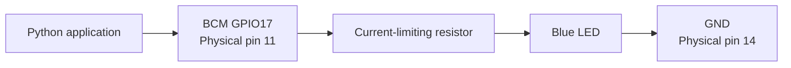

# Raspberry Pi LED Controller

A Raspberry Pi 5 embedded-systems project that controls a blue LED using Python,
GPIO, a breadboard, and a current-limiting resistor.

This project documents both the software and electrical troubleshooting process,
including GPIO verification, LED polarity testing, multimeter measurements,
schematic interpretation, and comparison with industrial ladder logic.

## Project Demonstration

The Python application alternates BCM GPIO17 between HIGH and LOW states,
causing the blue LED to blink once per second.



## Skills Demonstrated

- Raspberry Pi 5 configuration
- Linux development environment
- Python and `gpiozero`
- GPIO digital-output control
- Breadboard circuit construction
- LED polarity identification
- DC voltage measurement
- Diode testing with a multimeter
- Hardware and software troubleshooting
- Git and GitHub source control
- Electrical schematic documentation
- PLC ladder-logic comparison

## Hardware

- Raspberry Pi 5
- Raspberry Pi OS
- Breadboard
- Blue LED
- Current-limiting resistor
- Male-to-female jumper wires
- Digital multimeter
- Monitor, keyboard, and mouse

## Pin Assignments

| Physical Pin | BCM GPIO | Function |
|---:|---:|---|
| 11 | GPIO17 | Blue LED digital output |
| 14 | GND | Circuit common/ground |

## Circuit

```text
GPIO17 ─── resistor ─── LED ─── GND
```

Detailed wiring and schematic documentation:

- [Wiring and Electrical Schematic](wiring-diagram.md)
- [Ladder Logic Comparison](ladder-logic.md)

## Software Requirements

- Python 3
- `gpiozero`

Verify the package:

```bash
python3 -c "from gpiozero import LED; print('gpiozero is ready')"
```

## Run the Project

Clone the repository:

```bash
git clone https://github.com/Thee-Hector-Genaro-Pacheco/raspberry-pi-led-controller.git
cd raspberry-pi-led-controller
```

Run the controller:

```bash
python3 blink.py
```

Stop the controller safely:

```text
Ctrl+C
```

## Expected Output

```text
Blue LED controller started.
BCM GPIO17 / physical pin 11
Press Ctrl+C to stop.
BLUE LED: ON
BLUE LED: OFF
```

## Troubleshooting Process

The LED initially failed to illuminate even though GPIO17 measured approximately
3.3 VDC.

The troubleshooting process included:

1. Confirming GPIO17 was configured as an output.
2. Measuring GPIO17 relative to Raspberry Pi ground.
3. Testing breadboard row continuity.
4. Testing the LED using the multimeter's diode-test function.
5. Confirming the LED was functional.
6. Measuring voltage directly across the LED.
7. Identifying reversed LED polarity.
8. Rotating the LED so its anode faced the resistor and its cathode faced ground.
9. Confirming successful LED operation.

This demonstrated that voltage may be present even when an electronic component
is installed incorrectly or when a circuit lacks a proper current path.

## Future Improvements

- Add a physical push button
- Add red and green status LEDs
- Add a light-dependent resistor or digital light sensor
- Create a traffic-light state machine
- Add a web-based control dashboard
- Log GPIO state changes
- Integrate the GPS receiver
- Package the application as a Linux service
- Create automated Python tests
- Add photographs and a formal schematic image

## Project Structure

```text
raspberry-pi-led-controller/
├── .gitignore
├── README.md
├── blink.py
├── images/
├── ladder-logic.md
└── wiring-diagram.md
```

## Safety

This project uses Raspberry Pi 3.3 V GPIO logic.

- Do not connect 5 V directly to a GPIO pin.
- Always use an appropriate resistor in series with an LED.
- Do not perform continuity or resistance tests on an energized circuit.
- Confirm pin numbering before energizing the circuit.
- GPIO numbers used in Python are BCM numbers, not physical header positions.

## Author

Hector Pacheco

Computer science student and instrumentation and controls technician exploring
embedded systems, industrial automation, Python, software engineering, and
hardware integration.
