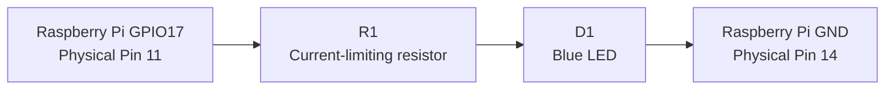

# Wiring and Electrical Schematic

## Purpose

This document describes the electrical connections for a Raspberry Pi 5
controlling a blue LED through BCM GPIO17.

GPIO17 is configured as a **digital output**. When the output is HIGH,
approximately 3.3 V is applied to the LED circuit.

---

## Raspberry Pi Pin Assignments

| Physical Pin | BCM Designation | Function | Wire Color |
|---:|---:|---|---|
| 11 | GPIO17 | Digital output | Yellow |
| 14 | GND | Ground/common return | Black |

> Physical pin numbers describe the location on the 40-pin Raspberry Pi header.
> BCM numbers are the GPIO identifiers used by Python and `gpiozero`.

---

## Breadboard Connection Schedule

| Connection | Start | End |
|---|---|---|
| GPIO output wire | Raspberry Pi physical pin 11 | Breadboard A10 |
| Current-limiting resistor | Breadboard C10 | Breadboard C15 |
| LED anode, positive side | Breadboard D15 | LED |
| LED cathode, negative side | LED | Breadboard D20 |
| Ground jumper | Breadboard E20 | Blue ground rail |
| Ground/common wire | Blue ground rail | Raspberry Pi physical pin 14 |

Rows A through E on the same numbered row are electrically connected.

For example:

```text
A10 = B10 = C10 = D10 = E10
```

The blue ground rail is separate from the numbered terminal rows.

---

## Standard Circuit Schematic

```text
          Raspberry Pi 5
       BCM GPIO17 / Pin 11
                 │
                 │
             R1  │
          ┌─/\/\/\/─┐
          │ Current │
          │ limiting│
          │ resistor│
          └────┬────┘
               │
               │  D1 Blue LED
               ├────|>|────┐
               │           │
                           ⏚
                     GND / Pin 14
```

A simplified left-to-right version is:

```text
GPIO17 ─── R1 ────|>|──── GND
                  D1
```

### Symbol meanings

| Reference | Symbol | Meaning |
|---|---|---|
| R1 | `/\/\/\/` | Current-limiting resistor |
| D1 | `|>|` | LED/diode |
| GND | `⏚` | Ground or common return |
| GPIO17 | Digital output | Raspberry Pi-controlled 3.3 V signal |

---

## Functional Signal Path



---

## Breadboard Layout

```text
Raspberry Pi pin 11
GPIO17 yellow wire
        │
        ▼
       A10
        │
A10 ─ B10 ─ C10 ─ D10 ─ E10
              │
              │ R1
              │
A15 ─ B15 ─ C15 ─ D15 ─ E15
                    │
                    │ LED anode (+)
                   |>| D1
                    │ LED cathode (-)
                    │
A20 ─ B20 ─ C20 ─ D20 ─ E20
                              │
                              ▼
                       Blue ground rail
                              │
                              ▼
                 Raspberry Pi pin 14 GND
```

---

## LED Polarity

An LED is polarity-sensitive.

- **Anode:** positive side, normally the longer lead
- **Cathode:** negative side, normally the shorter lead
- The flat edge on the LED body identifies the cathode

Correct current direction:

```text
GPIO17 → resistor → LED anode → LED cathode → GND
```

If the LED is installed backward, the circuit may measure voltage but the LED
will not illuminate.

---

## Expected Measurements

With GPIO17 commanded HIGH:

| Measurement | Expected Result |
|---|---:|
| GPIO17 to GND | Approximately 3.3 VDC |
| Across a blue LED while illuminated | Approximately 2.3–2.8 VDC |
| Ground rail to Raspberry Pi GND | Approximately 0 V |

The exact LED forward voltage may vary.

---

## Safe Testing Practices

1. Use DC voltage mode when measuring an energized circuit.
2. Connect the black meter lead to ground/common.
3. Connect the red meter lead to the point being measured.
4. Do not perform resistance or continuity tests on an energized circuit.
5. Do not place a multimeter configured for current measurement directly
   across GPIO17 and ground.
6. Always use a current-limiting resistor with the LED.
